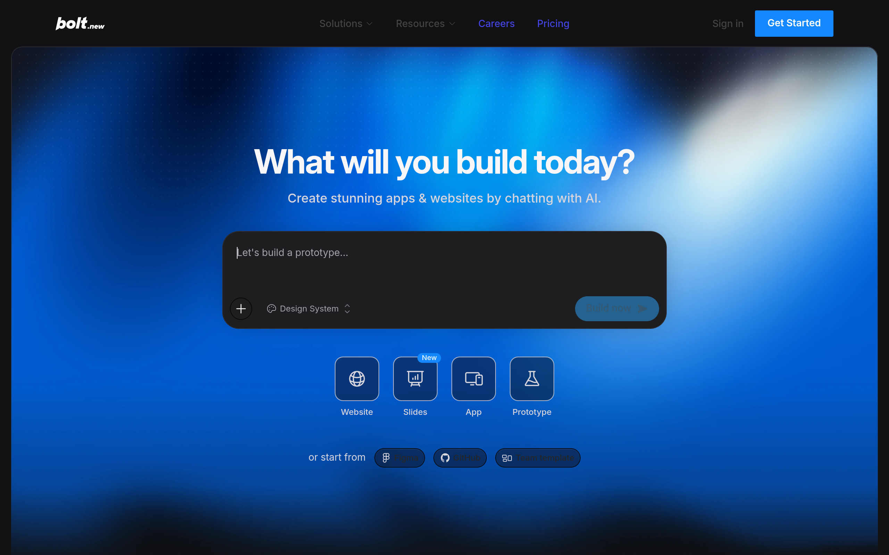

# bolt Design System

You are building UI for **bolt**. Light-themed, cool palette, sans-serif typography (Cormorant Garamond), compact density on a 4px grid, expressive motion.

## Visual Reference

**IMPORTANT**: Study ALL screenshots below before writing any UI. Match colors, typography, spacing, layout, and motion exactly as shown.

### Homepage



> Read `references/DESIGN.md` for full token details.

## Design Philosophy

- **Layered depth** — use shadow tokens to create a sense of physical layering. Each elevation level has a specific shadow.
- **Gradient accents** — gradients are used thoughtfully for emphasis, not decoration.
- **Type pairing** — Cormorant Garamond for body/UI text, Schibsted Grotesk for headings/display. Never introduce a third typeface.
- **compact density** — 4px base grid. Every dimension is a multiple of 4.
- **cool palette** — the color temperature runs cool, matching the sans-serif typography.
- **Restrained accent** — `#96beff` is the only pop of color. Used exclusively for CTAs, links, focus rings, and active states.
- **Expressive motion** — animations are an integral part of the experience. Use spring physics and layout animations.

## Color System

### Core Palette

| Role | Token | Hex | Use |
|------|-------|-----|-----|
| Background | `--background` | `#ffffff` | Page/app background |
| Text Primary | `--text-primary` | `#000000` | Headings, body text |
| Text Muted | `--text-muted` | `#ababab` | Captions, placeholders |
| Accent | `--accent` | `#96beff` | CTAs, links, focus rings |
| Border | `--border` | `#1e1e21` | Dividers, card borders |

### Status Colors

| Status | Hex | Use |
|--------|-----|-----|
| Success | `#22c55e` | Confirmations, positive trends |
| Warning | `#f79009` | Caution states, pending items |
| Danger | `#ef4444` | Errors, destructive actions |

### Extended Palette

- **plyr-color-main:** `#1488fc`
- **theme-color:** `#111114` — Deep background layer or shadow color
- `#7fddc1`
- `#0f6fd0`
- **bolt-ds-neutralBorderSubtle:** `#737373` — Secondary text, placeholder text
- **bolt-ds-brandBgSubtle:** `#2ba6ff` — Core brand color
- `#0b57c9`
- **bolt-ds-borderSecondary:** `#e5e7eb` — Secondary text, placeholder text

### CSS Variable Tokens

```css
--border-radius: 8px;
--normal-border: var(--gray4);
--success-border: hsl(145,92%,91%);
--info-border: hsl(221,91%,91%);
--warning-border: hsl(49,91%,91%);
--error-border: hsl(359,100%,94%);
--normal-border: hsl(0,0%,20%);
--normal-border: var(--gray3);
--normal-border: hsl(0,0%,20%);
--normal-border-hover: hsl(0,0%,25%);
--success-border: hsl(147,100%,12%);
--info-border: hsl(223,100%,12%);
--warning-border: hsl(60,100%,12%);
--error-border: hsl(357,89%,16%);
--bolt-ds-brandBorderSubtle: #2ba6ff33;
--bolt-ds-bgSecondary: 249 246 249;
--bolt-ds-bgSecondaryHover: 243 240 245;
--bolt-ds-bgSecondaryAlt: 249 246 249;
--bolt-ds-bgSecondaryAltHover: 243 240 245;
--bolt-ds-textPrimary: 12 12 15;
```

## Typography

### Font Stack

- **Cormorant Garamond** — Heading 1, Heading 2, Heading 3
- **Schibsted Grotesk** — Body, Caption
- **SFMono-Regular** — Code

### Font Sources

```css
@font-face {
  font-family: "Inter";
  src: url("fonts/Inter-Bold.ttf") format("truetype");
  font-weight: 700;
}
@font-face {
  font-family: "Inter";
  src: url("fonts/Inter-Regular.ttf") format("truetype");
  font-weight: 400;
}
@font-face {
  font-family: "Inter Display";
  src: url("fonts/InterDisplay-700.woff2") format("woff2");
  font-weight: 700;
}
@font-face {
  font-family: "Silkscreen";
  src: url("fonts/Silkscreen-Bold.ttf") format("truetype");
  font-weight: 700;
}
@font-face {
  font-family: "Silkscreen";
  src: url("fonts/Silkscreen-Regular.ttf") format("truetype");
  font-weight: 400;
}
@font-face {
  font-family: "ApfelGrotezk";
  src: url("fonts/ApfelGrotezk-Regular.woff2") format("woff2");
  font-weight: 400;
}
@font-face {
  font-family: "Schibsted Grotesk";
  src: url("fonts/SchibstedGrotesk-Bold.ttf") format("truetype");
  font-weight: 700;
}
@font-face {
  font-family: "Schibsted Grotesk";
  src: url("fonts/SchibstedGrotesk-Regular.ttf") format("truetype");
  font-weight: 400;
}
@font-face {
  font-family: "Cormorant Garamond";
  src: url("fonts/CormorantGaramond-Bold.ttf") format("truetype");
  font-weight: 700;
}
@font-face {
  font-family: "Cormorant Garamond";
  src: url("fonts/CormorantGaramond-Regular.ttf") format("truetype");
  font-weight: 400;
}
```

### Type Scale

| Role | Family | Size | Weight |
|------|--------|------|--------|
| Heading 1 | Cormorant Garamond | 8rem | 700 |
| Heading 2 | Cormorant Garamond | 6rem | 700 |
| Heading 3 | Cormorant Garamond | 72px | 700 |
| Body | Schibsted Grotesk | 14px | 400 |
| Caption | Schibsted Grotesk | 15px | 400 |
| Code | SFMono-Regular | 14px | 400 |

### Typography Rules

- Body/UI: **Cormorant Garamond**, Headings: **Schibsted Grotesk** — these are the only display fonts
- Max 3-4 font sizes per screen
- Headings: weight 600-700, body: weight 400
- Use color and opacity for text hierarchy, not additional font sizes
- Line height: 1.5 for body, 1.2 for headings

## Spacing & Layout

### Base Grid: 4px

Every dimension (margin, padding, gap, width, height) must be a multiple of **4px**.

### Spacing Scale

`2, 4, 6, 8, 10, 12, 14, 16, 18, 20, 22, 24` px

### Spacing as Meaning

| Spacing | Use |
|---------|-----|
| 4-8px | Tight: related items (icon + label, avatar + name) |
| 12-16px | Medium: between groups within a section |
| 24-32px | Wide: between distinct sections |
| 48px+ | Vast: major page section breaks |

### Border Radius

Scale: `.125rem, .25rem, .375rem, .44rem, .5rem, .75rem, 1rem, 1px, 1.5rem, 2px, 2rem, 3px, 4px, 6px, 7px, 9px, 10px, 12px, 15px, 20%, 20px, 32px, inherit, 8px, 16px, 24px, 40px, 48px, 56px, 100%, 999px`
Default: `9px`

### Container

Max-width: `1024px`, centered with auto margins.

### Breakpoints

| Name | Value |
|------|-------|
| xs | 420px |
| xs | 480px |
| sm | 540px |
| sm | 560px |
| sm | 600px |
| sm | 639.9px |
| sm | 640px |
| md | 720px |
| md | 767.9px |
| md | 768px |
| lg | 900px |
| lg | 980px |
| lg | 1024px |
| xl | 1025px |
| xl | 1130px |
| xl | 1200px |
| xl | 1280px |
| 2xl | 1536px |

Mobile-first: design for small screens, layer on responsive overrides.

## Component Patterns

### Card

```css
.card {
  background: #ffffff;
  border: 1px solid #1e1e21;
  border-radius: 9px;
  padding: 16px;
  box-shadow: var(--un-ring-offset-shadow),var(--un-ring-shadow),var(--un-shadow);
}
```

```html
<div class="card">
  <h3>Card Title</h3>
  <p>Card content goes here.</p>
</div>
```

### Button

```css
/* Primary */
.btn-primary {
  background: #96beff;
  color: #000000;
  border-radius: 9px;
  padding: 8px 16px;
  font-weight: 500;
  transition: opacity 150ms ease;
}
.btn-primary:hover { opacity: 0.9; }

/* Ghost */
.btn-ghost {
  background: transparent;
  border: 1px solid #1e1e21;
  color: #000000;
  border-radius: 9px;
  padding: 8px 16px;
}
```

```html
<button class="btn-primary">Get Started</button>
<button class="btn-ghost">Learn More</button>
```

### Input

```css
.input {
  background: #ffffff;
  border: 1px solid #1e1e21;
  border-radius: 9px;
  padding: 8px 12px;
  color: #000000;
  font-size: 14px;
}
.input:focus { border-color: #96beff; outline: none; }
```

```html
<input class="input" type="text" placeholder="Search..." />
```

### Badge / Chip

```css
.badge {
  display: inline-flex;
  align-items: center;
  padding: 4px 8px;
  border-radius: 9999px;
  font-size: 12px;
  font-weight: 500;
  background: #ffffff;
  color: #ababab;
}
```

```html
<span class="badge">New</span>
<span class="badge">Beta</span>
```

### Modal / Dialog

```css
.modal-backdrop { background: rgba(0, 0, 0, 0.6); }
.modal {
  background: #ffffff;
  border: 1px solid #1e1e21;
  border-radius: 999px;
  padding: 24px;
  max-width: 480px;
  width: 90vw;
  box-shadow: 0 4px 12px #0000001a;
}
```

```html
<div class="modal-backdrop">
  <div class="modal">
    <h2>Dialog Title</h2>
    <p>Dialog content.</p>
    <button class="btn-primary">Confirm</button>
    <button class="btn-ghost">Cancel</button>
  </div>
</div>
```

### Table

```css
.table { width: 100%; border-collapse: collapse; }
.table th {
  text-align: left;
  padding: 8px 12px;
  font-weight: 500;
  font-size: 12px;
  color: #ababab;
  text-transform: uppercase;
  letter-spacing: 0.05em;
  border-bottom: 1px solid #1e1e21;
}
.table td {
  padding: 12px;
  border-bottom: 1px solid #1e1e21;
}
```

```html
<table class="table">
  <thead><tr><th>Name</th><th>Status</th><th>Date</th></tr></thead>
  <tbody>
    <tr><td>Item One</td><td>Active</td><td>Jan 1</td></tr>
    <tr><td>Item Two</td><td>Pending</td><td>Jan 2</td></tr>
  </tbody>
</table>
```

### Navigation

```css
.nav {
  display: flex;
  align-items: center;
  gap: 8px;
  padding: 12px 16px;
  border-bottom: 1px solid #1e1e21;
}
.nav-link {
  color: #ababab;
  padding: 8px 12px;
  border-radius: 9px;
  transition: color 150ms;
}
.nav-link:hover { color: #000000; }
.nav-link.active { color: #96beff; }
```

```html
<nav class="nav">
  <a href="/" class="nav-link active">Home</a>
  <a href="/about" class="nav-link">About</a>
  <a href="/pricing" class="nav-link">Pricing</a>
  <button class="btn-primary" style="margin-left: auto">Get Started</button>
</nav>
```

### Extracted Components

These components were found in the codebase:

**Button** (`html`)
- Variants: `primary`

**Card** (`html`)
- Variants: `strip`, `strip--social`, `hover-canvas`, `preview`, `shot`

**Badge** (`html`)

**Modal** (`html`)

**List** (`html`)

## Page Structure

The following page sections were detected:

- **Navigation** — Top navigation bar (3 items)
- **Hero** — Hero/banner section with headline and CTAs
- **Features** — Feature/benefit cards grid
- **Footer** — Page footer with links and info (19 items)
- **Cta** — Call-to-action section
- **Faq** — FAQ/accordion section
- **Testimonials** — Testimonials/reviews section
- **Stats** — Statistics/metrics display

When building pages, follow this section order and structure.

## Animation & Motion

This project uses **expressive motion**. Animations are part of the design language.

### CSS Animations

- `swipe-out-left`
- `swipe-out-right`
- `swipe-out-up`
- `swipe-out-down`
- `sonner-fade-in`

### Motion Tokens

- **Duration scale:** `0s`, `0ms`, `0.01s`, `.1s`, `.15s`, `.2s`, `.3s`, `.5s`, `.7s`, `1s`, `60ms`, `75ms`, `100ms`, `150ms`, `180ms`, `200ms`, `220ms`, `240ms`, `250ms`, `260ms`, `280ms`, `300ms`, `320ms`, `350ms`, `360ms`, `380ms`, `400ms`, `450ms`, `500ms`, `600ms`, `800ms`, `1300ms`
- **Easing functions:** `ease`, `ease-out`, `cubic-bezier(.32,.72,0,1)`, `cubic-bezier(.22,1,.36,1)`, `cubic-bezier(.4,0,.2,1)`, `linear`, `cubic-bezier(0,0,.2,1)`, `cubic-bezier(.165,.84,.44,1)`, `cubic-bezier(.2,.7,.2,1)`, `cubic-bezier(0.22,1,0.36,1)`, `cubic-bezier(0.165,0.84,0.44,1)`, `cubic-bezier(0.4,0,0.2,1)`, `cubic-bezier(0.34,1.56,0.64,1)`, `cubic-bezier(.34,1.56,.64,1)`, `cubic-bezier(.22,.61,.36,1)`, `cubic-bezier(.25,.46,.45,.94)`
- **Animated properties:** `transform`

### Motion Guidelines

- **Duration:** Use values from the duration scale above. Short (0s) for micro-interactions, long (1300ms) for page transitions
- **Easing:** Use `ease` as the default easing curve
- **Direction:** Elements enter from bottom/right, exit to top/left
- **Reduced motion:** Always respect `prefers-reduced-motion` — disable animations when set

## Depth & Elevation

### Shadow Tokens

- Subtle: `0 0 0 2px #0006`
- Subtle: `inset 0 1px #ffffff0d`
- Subtle: `inset 0 1px #ffffffb3,0 1px 2px #0f172a0a`
- Subtle: `0 0 0 1px #00000040,0 1px 2px #00000059`
- Subtle: `0 1px 2px #00000080`
- Subtle: `0 0 0 1px #1488fc`

### Z-Index Scale

`0, 1, 2, 3, 4, 5, 6, 7, 8, 9, 10, 20, 21, 30, 40, 50, 60, 90, 99, 100, 995, 997, 998, 999, 1000, 9999, 999999999`

Use these exact values — never invent z-index values.

## Anti-Patterns (Never Do)

- **No blur effects** — no backdrop-blur, no filter: blur()
- **No zebra striping** — tables and lists use borders for separation
- **No invented colors** — every hex value must come from the palette above
- **No arbitrary spacing** — every dimension is a multiple of 4px
- **No extra fonts** — only Cormorant Garamond and Schibsted Grotesk and SFMono-Regular are allowed
- **No arbitrary border-radius** — use the scale: .125rem, .25rem, .375rem, .44rem, .5rem, .75rem, 1rem, 1px, 1.5rem, 2px
- **No opacity for disabled states** — use muted colors instead

## Workflow

1. **Read** `references/DESIGN.md` before writing any UI code
2. **Pick colors** from the Color System section — never invent new ones
3. **Set typography** — Cormorant Garamond, Schibsted Grotesk, SFMono-Regular only, using the type scale
4. **Build layout** on the 4px grid — check every margin, padding, gap
5. **Match components** to patterns above before creating new ones
6. **Apply elevation** — use shadow tokens
7. **Validate** — every value traces back to a design token. No magic numbers.

## Brand Spec

- **Favicon:** `/static/favicon.svg`
- **Site URL:** `https://bolt.new/`
- **Brand color:** `#96beff`
- **Brand typeface:** Cormorant Garamond

## Quick Reference

```
Background:     #ffffff
Surface:        (not extracted)
Text:           #000000 / #ababab
Accent:         #96beff
Border:         #1e1e21
Font:           Cormorant Garamond
Spacing:        4px grid
Radius:         9px
Components:     11 detected
```

## When to Trigger

Activate this skill when:
- Creating new components, pages, or visual elements for bolt
- Writing CSS, Tailwind classes, styled-components, or inline styles
- Building page layouts, templates, or responsive designs
- Reviewing UI code for design consistency
- The user mentions "bolt" design, style, UI, or theme
- Generating mockups, wireframes, or visual prototypes

---

# Full Reference Files

> Every output file is embedded below. Claude has full design system context from /skills alone.

## Design System Tokens (DESIGN.md)

# bolt DESIGN.md

> Auto-generated design system — reverse-engineered via static analysis by skillui.
> Frameworks: None detected
> Colors: 20 · Fonts: 3 · Components: 11
> Icon library: not detected · State: not detected
> Primary theme: light · Dark mode toggle: no · Motion: expressive

## Visual Reference

**Match this design exactly** — study colors, fonts, spacing, and component shapes before writing any UI code.


---

## 1. Visual Theme & Atmosphere

This is a **light-themed** interface with a cool, approachable feel. The light background emphasizes content clarity. Typography pairs **Schibsted Grotesk** for display/headings with **Cormorant Garamond** for body text, creating clear visual hierarchy through type contrast. Spacing follows a **4px base grid** (compact density), with scale: 2, 4, 6, 8, 10, 12, 14, 16px. The accent color **#96beff** anchors interactive elements (buttons, links, focus rings). Motion is expressive — spring physics, layout animations, and staggered reveals are part of the visual language.

---

## 2. Color Palette & Roles

| Token | Hex | Role | Use |
|---|---|---|---|
| un-ring-offset-color | `#ffffff` | background | Page background, darkest surface |
| agent-color | `#000000` | text-primary | Headings and body text |
| sc-text-sub | `#ababab` | text-muted | Captions, placeholders, secondary info |
| text-secondary | `#525258` | text-muted | Captions, placeholders, secondary info |
| bolt-ds-borderSecondary | `#1e1e21` | border | Dividers, card borders, outlines |
| accent | `#96beff` | accent | CTAs, links, focus rings, active states |
| bolt-ds-dangerBgSubtle | `#ef4444` | danger | Error states, destructive actions |
| bolt-ds-successBgSubtle | `#22c55e` | success | Success states, positive indicators |
| bolt-ds-warningBgSubtle | `#f79009` | warning | Warning states, caution indicators |
| plyr-color-main | `#1488fc` | info | Informational highlights |
| theme-color | `#111114` | unknown | Palette color |
| unknown | `#7fddc1` | unknown | Palette color |
| unknown | `#0f6fd0` | unknown | Palette color |
| bolt-ds-neutralBorderSubtle | `#737373` | unknown | Palette color |
| bolt-ds-brandBgSubtle | `#2ba6ff` | unknown | Palette color |
| unknown | `#0b57c9` | unknown | Palette color |
| bolt-ds-borderSecondary | `#e5e7eb` | unknown | Palette color |
| normal-border | `#333333` | unknown | Palette color |
| success-bg | `#ecfdf3` | unknown | Palette color |
| unknown | `#3b82f6` | unknown | Palette color |

### CSS Variable Tokens

```css
--border-radius: 8px;
--normal-border: var(--gray4);
--success-border: hsl(145,92%,91%);
--info-border: hsl(221,91%,91%);
--warning-border: hsl(49,91%,91%);
--error-border: hsl(359,100%,94%);
--normal-border: hsl(0,0%,20%);
--normal-border: var(--gray3);
--normal-border: hsl(0,0%,20%);
--normal-border-hover: hsl(0,0%,25%);
--success-border: hsl(147,100%,12%);
--info-border: hsl(223,100%,12%);
--warning-border: hsl(60,100%,12%);
--error-border: hsl(357,89%,16%);
--un-border-spacing-x: 0;
--un-border-spacing-y: 0;
--un-border-spacing-x: 0;
--un-border-spacing-y: 0;
--un-border-opacity: 1;
--un-border-opacity: 1;
```


---

## 3. Typography Rules

**Font Stack:**
- **Cormorant Garamond** — Heading 1, Heading 2, Heading 3
- **Schibsted Grotesk** — Body, Caption
- **SFMono-Regular** — Code

**Font Sources:**

```css
@font-face {
  font-family: "Inter";
  src: url("fonts/Inter-Bold.ttf") format("truetype");
  font-weight: 700;
}
@font-face {
  font-family: "Inter";
  src: url("fonts/Inter-Regular.ttf") format("truetype");
  font-weight: 400;
}
@font-face {
  font-family: "Inter Display";
  src: url("fonts/InterDisplay-700.woff2") format("woff2");
  font-weight: 700;
}
@font-face {
  font-family: "Silkscreen";
  src: url("fonts/Silkscreen-Bold.ttf") format("truetype");
  font-weight: 700;
}
@font-face {
  font-family: "Silkscreen";
  src: url("fonts/Silkscreen-Regular.ttf") format("truetype");
  font-weight: 400;
}
@font-face {
  font-family: "ApfelGrotezk";
  src: url("fonts/ApfelGrotezk-Regular.woff2") format("woff2");
  font-weight: 400;
}
@font-face {
  font-family: "Schibsted Grotesk";
  src: url("fonts/SchibstedGrotesk-Bold.ttf") format("truetype");
  font-weight: 700;
}
@font-face {
  font-family: "Schibsted Grotesk";
  src: url("fonts/SchibstedGrotesk-Regular.ttf") format("truetype");
  font-weight: 400;
}
@font-face {
  font-family: "Cormorant Garamond";
  src: url("fonts/CormorantGaramond-Bold.ttf") format("truetype");
  font-weight: 700;
}
@font-face {
  font-family: "Cormorant Garamond";
  src: url("fonts/CormorantGaramond-Regular.ttf") format("truetype");
  font-weight: 400;
}
```

| Role | Font | Size | Weight |
|---|---|---|---|
| Heading 1 | Cormorant Garamond | 8rem | 700 |
| Heading 2 | Cormorant Garamond | 6rem | 700 |
| Heading 3 | Cormorant Garamond | 72px | 700 |
| Body | Schibsted Grotesk | 14px | 400 |
| Caption | Schibsted Grotesk | 15px | 400 |
| Code | SFMono-Regular | 14px | 400 |

**Typographic Rules:**
- Limit to 3 font families max per screen
- Use **Cormorant Garamond** for body/UI text, **Schibsted Grotesk** for display/headings
- Maintain consistent hierarchy: no more than 3-4 font sizes per screen
- Headings use bold (600-700), body uses regular (400)
- Line height: 1.5 for body text, 1.2 for headings
- Use color and opacity for secondary hierarchy, not additional font sizes


---

## 4. Component Stylings

### Layout (1)

**Footer** — `html`

### Navigation (1)

**Navigation** — `html`

### Data Display (3)

**Card** — `html`
- Variants: `strip`, `strip--social`, `hover-canvas`, `preview`, `shot`

**Badge** — `html`

**List** — `html`

### Data Input (2)

**Button** — `html`
- Variants: `primary`
- Animation: 

**Input** — `html`
- State: :focus, :placeholder

### Overlay (1)

**Modal** — `html`

### Media (3)

**Image** — `html`

**Icon** — `html`

**Map/Canvas** — `html`


---

## 5. Layout Principles

- **Base spacing unit:** 4px
- **Spacing scale:** 2, 4, 6, 8, 10, 12, 14, 16, 18, 20, 22, 24
- **Border radius:** .125rem, .25rem, .375rem, .44rem, .5rem, .75rem, 1rem, 1px, 1.5rem, 2px, 2rem, 3px, 4px, 6px, 7px, 9px, 10px, 12px, 15px, 20%, 20px, 32px, inherit, 8px, 16px, 24px, 40px, 48px, 56px, 100%, 999px
- **Max content width:** 1024px

**Spacing as Meaning:**
| Spacing | Use |
|---|---|
| 4-8px | Tight: related items within a group |
| 12-16px | Medium: between groups |
| 24-32px | Wide: between sections |
| 48px+ | Vast: major section breaks |


---

## 6. Depth & Elevation

### Flat — subtle depth hints

- `0 0 0 2px #0006`
- `inset 0 1px #ffffff0d`
- `inset 0 1px #ffffffb3,0 1px 2px #0f172a0a`

### Raised — cards, buttons, interactive elements

- `var(--un-ring-offset-shadow),var(--un-ring-shadow),var(--un-shadow)`
- `inset 0 1px #ffffffe6,0 2px 8px #0f172a0f`
- `0 0 0 3px rgba(41,197,122,0.18)`

### Floating — dropdowns, popovers, modals

- `0 4px 12px #0000001a`
- `0 4px 12px #0000001a,0 0 0 2px #0003`
- `inset 0 1px #fffc,inset 0 0 20px rgb(var(--bolt-ds-brand)/.12),0 0 0 1px rgb(var(--bolt-ds-brand)/.35),0 0 20px rgb(var(--bolt-ds-brand)/.2),0 8px 20px #0f172a14`

### Overlay — full-screen overlays, top-level dialogs

- `0 24px 60px #0000008c`
- `0 24px 60px #1111141f`
- `inset 0 1px #ffffff14,inset 0 0 20px rgb(var(--bolt-ds-brand)/.18),0 0 0 1px rgb(var(--bolt-ds-brand)/.5),0 0 24px rgb(var(--bolt-ds-brand)/.45),0 10px 24px #060a1480`

### Z-Index Scale

`0, 1, 2, 3, 4, 5, 6, 7, 8, 9, 10, 20, 21, 30, 40, 50, 60, 90, 99, 100, 995, 997, 998, 999, 1000, 9999, 999999999`


---

## 7. Animation & Motion

This project uses **expressive motion**. Animations are an integral part of the experience.

### CSS Animations

- `@keyframes swipe-out-left`
- `@keyframes swipe-out-right`
- `@keyframes swipe-out-up`
- `@keyframes swipe-out-down`
- `@keyframes sonner-fade-in`
- `@keyframes sonner-fade-out`
- `@keyframes sonner-spin`
- `@keyframes shadcn-down`

### Animated Components

- **Button**: 

### Motion Guidelines

- Duration: 150-300ms for micro-interactions, 300-500ms for page transitions
- Easing: `ease-out` for enters, `ease-in` for exits
- Always respect `prefers-reduced-motion`


---

## 8. Do's and Don'ts

### Do's

- Use `#96beff` for interactive elements (buttons, links, focus rings)
- Use `#ffffff` as the primary page background
- Pair **Cormorant Garamond** (body) with **Schibsted Grotesk** (display) — these are the only allowed fonts
- Follow the **4px** spacing grid for all margins, padding, and gaps
- Use the defined shadow tokens for elevation — see Section 6
- Use border-radius from the scale: .125rem, .25rem, .375rem, .44rem, .5rem
- Reuse existing components from Section 4 before creating new ones

### Don'ts

- Don't introduce colors outside this palette — extend the design tokens first
- Don't introduce additional font families beyond Cormorant Garamond and Schibsted Grotesk and SFMono-Regular
- Don't use arbitrary spacing values — stick to multiples of 4px
- Don't create custom box-shadow values outside the system tokens
- Don't use arbitrary border-radius values — pick from the defined scale
- Don't duplicate component patterns — check Section 4 first
- Don't use backdrop-blur or blur effects

### Anti-Patterns (detected from codebase)

- No blur or backdrop-blur effects
- No zebra striping on tables/lists


---

## 9. Responsive Behavior

| Name | Value | Source |
|---|---|---|
| xs | 420px | css |
| xs | 480px | css |
| sm | 540px | css |
| sm | 560px | css |
| sm | 600px | css |
| sm | 639.9px | css |
| sm | 640px | css |
| md | 720px | css |
| md | 767.9px | css |
| md | 768px | css |
| lg | 900px | css |
| lg | 980px | css |
| lg | 1024px | css |
| xl | 1025px | css |
| xl | 1130px | css |
| xl | 1200px | css |
| xl | 1280px | css |
| 2xl | 1536px | css |

**Approach:** Use `@media (min-width: ...)` queries matching the breakpoints above.


---

## 10. Agent Prompt Guide

Use these as starting points when building new UI:

### Build a Card

```
Background: #ffffff
Border: 1px solid #1e1e21
Radius: 9px
Padding: 16px
Font: Cormorant Garamond
Use shadow tokens from Section 6.
```

### Build a Button

```
Primary: bg #96beff, text white
Ghost: bg transparent, border #1e1e21
Padding: 8px 16px
Radius: 9px
Hover: opacity 0.9 or lighter shade
Focus: ring with #96beff
```

### Build a Page Layout

```
Background: #ffffff
Max-width: 1024px, centered
Grid: 4px base
Responsive: mobile-first, breakpoints from Section 9
```

### Build a Stats Card

```
Surface: #ffffff
Label: #ababab (muted, 12px, uppercase)
Value: #000000 (primary, 24-32px, bold)
Status: use success/warning/danger from Section 2
```

### Build a Form

```
Input bg: #ffffff
Input border: 1px solid #1e1e21
Focus: border-color #96beff
Label: #ababab 12px
Spacing: 16px between fields
Radius: 9px
```

### General Component

```
1. Read DESIGN.md Sections 2-6 for tokens
2. Colors: only from palette
3. Font: Cormorant Garamond, type scale from Section 3
4. Spacing: 4px grid
5. Components: match patterns from Section 4
6. Elevation: shadow tokens
```

## Bundled Fonts (fonts/)

The following font files are bundled in the `fonts/` directory:

- `fonts/ApfelGrotezk-500.woff2`
- `fonts/ApfelGrotezk-Regular.woff2`
- `fonts/CormorantGaramond-Bold.ttf`
- `fonts/CormorantGaramond-Light.ttf`
- `fonts/CormorantGaramond-Medium.ttf`
- `fonts/CormorantGaramond-Regular.ttf`
- `fonts/CormorantGaramond-SemiBold.ttf`
- `fonts/Inter-Black.ttf`
- `fonts/Inter-Bold.ttf`
- `fonts/Inter-ExtraBold.ttf`
- `fonts/Inter-ExtraLight.ttf`
- `fonts/Inter-Light.ttf`
- `fonts/Inter-Medium.ttf`
- `fonts/Inter-Regular.ttf`
- `fonts/Inter-SemiBold.ttf`
- `fonts/Inter-Thin.ttf`
- `fonts/InterDisplay-600.woff2`
- `fonts/InterDisplay-700.woff2`
- `fonts/SchibstedGrotesk-Black.ttf`
- `fonts/SchibstedGrotesk-Bold.ttf`
- `fonts/SchibstedGrotesk-ExtraBold.ttf`
- `fonts/SchibstedGrotesk-Medium.ttf`
- `fonts/SchibstedGrotesk-Regular.ttf`
- `fonts/SchibstedGrotesk-SemiBold.ttf`
- `fonts/Silkscreen-Bold.ttf`
- `fonts/Silkscreen-Regular.ttf`

Use these local font files in `@font-face` declarations instead of fetching from Google Fonts.

## Homepage Screenshots (screenshots/)


