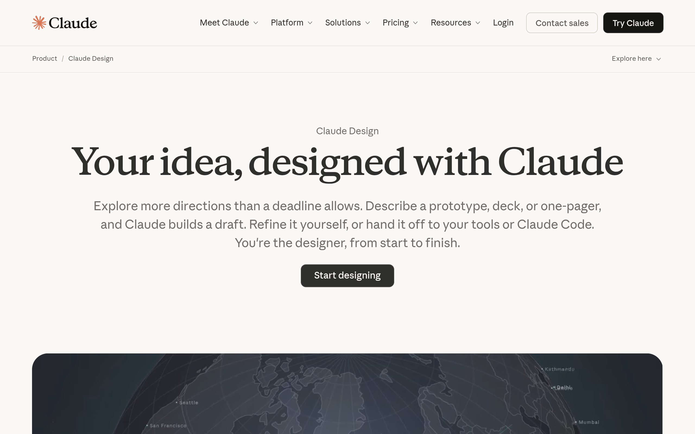

# claude DESIGN.md

> Auto-generated design system — reverse-engineered via static analysis by skillui.
> Frameworks: None detected
> Colors: 20 · Fonts: 3 · Components: 9
> Icon library: not detected · State: not detected
> Primary theme: light · Dark mode toggle: no · Motion: expressive

## Visual Reference

**Match this design exactly** — study colors, fonts, spacing, and component shapes before writing any UI code.



---

## 1. Visual Theme & Atmosphere

This is a **light-themed** interface with a warm, approachable feel. The light background emphasizes content clarity. Typography pairs **swiper-icons** for display/headings with **webflow-icons** for body text, creating clear visual hierarchy through type contrast. Spacing follows a **4px base grid** (compact density), with scale: 2, 4, 6, 8, 10, 12, 14, 16px. The accent color **#c46849** anchors interactive elements (buttons, links, focus rings). Motion is expressive — spring physics, layout animations, and staggered reveals are part of the visual language.

---

## 2. Color Palette & Roles

| Token | Hex | Role | Use |
|---|---|---|---|
| swiper-preloader-color | `#ffffff` | background | Page background, darkest surface |
| swiper-preloader-color | `#000000` | text-primary | Headings and body text |
| color-gray-500 | `#87867f` | text-muted | Captions, placeholders, secondary info |
| shell-text-placeholder | `#a1a0a0` | text-muted | Captions, placeholders, secondary info |
| color-gray-800 | `#222222` | border | Dividers, card borders, outlines |
| _theme---heroes-accent | `#c46849` | accent | CTAs, links, focus rings, active states |
| swiper-theme-color | `#007aff` | accent | CTAs, links, focus rings, active states |
| _theme---error-text | `#b53333` | danger | Error states, destructive actions |
| _theme---switch--background-active | `#2c84db` | info | Informational highlights |
| _theme---error-text | `#df6666` | unknown | Palette color |
| color-gray-150 | `#f0eee6` | unknown | Palette color |
| color-gray-200 | `#e8e6dc` | unknown | Palette color |
| color-gray-950 | `#141413` | unknown | Palette color |
| color-gray-750 | `#333333` | unknown | Palette color |
| color-gray-700 | `#3d3d3a` | unknown | Palette color |
| color-gray-400 | `#b0aea5` | unknown | Palette color |
| unknown | `#758696` | unknown | Palette color |
| color-gray-300 | `#c8c8c8` | unknown | Palette color |
| shell-text-primary | `#0b0b0b` | unknown | Palette color |
| color-oat | `#f0d5c7` | unknown | Palette color |

### CSS Variable Tokens

```css
--_theme---background-primary: var(--swatch--gray-050);
--_theme---foreground-primary: var(--swatch--gray-950);
--_typography---font--primary-regular: 400;
--_theme---foreground-tertiary: var(--swatch--gray-600);
--_theme---background-secondary: var(--swatch--gray-100);
--_typography---font--primary-family: "Anthropic Sans",Arial,sans-serif;
--_typography---font--primary-medium: 500;
--_typography---font--primary-bold: 700;
--border-width--main: .0625rem;
--_theme---border-primary: var(--swatch--gray-400);
--_theme---border-tertiary: var(--swatch--gray-200);
--_button-style---border-width: var(--border-width--main);
--_button-style---border: var(--_theme---button-brand--border);
--_theme---background-tertiary: var(--swatch--gray-150);
--_theme---border-secondary: var(--swatch--gray-300);
--_theme---foreground-secondary: var(--swatch--gray-750);
--_typography---font--primary-semibold: 600;
--_typography---font--primary-light: 300;
--_typography---font--secondary-family: "Anthropic Serif",Georgia,sans-serif;
--_theme---heroes-accent: var(--swatch--clay);
```


---

## 3. Typography Rules

**Font Stack:**
- **webflow-icons** — Heading 1, Heading 2, Heading 3
- **swiper-icons** — Body, Caption
- **Jetbrains Mono** — Code

**Font Sources:**

```css
@font-face {
  font-family: "Jetbrains Mono";
  src: url("fonts/JetbrainsMono-Regular.woff2") format("woff2");
  font-weight: 400;
}
@font-face {
  font-family: "Noto Sans";
  src: url("fonts/NotoSans-Bold.ttf") format("truetype");
  font-weight: 700;
}
@font-face {
  font-family: "Noto Sans";
  src: url("fonts/NotoSans-Regular.ttf") format("truetype");
  font-weight: 400;
}
@font-face {
  font-family: "Anthropic Sans";
  src: url("fonts/AnthropicSans-300.woff2") format("woff2");
  font-weight: 300;
}
@font-face {
  font-family: "Anthropic Serif";
  src: url("fonts/AnthropicSerif-300.woff2") format("woff2");
  font-weight: 300;
}
@font-face {
  font-family: "Anthropic Mono";
  src: url("fonts/AnthropicMono-300.woff2") format("woff2");
  font-weight: 300;
}
@font-face {
  font-family: "anthropicSans";
  src: url("fonts/anthropicSans-Regular.woff2") format("woff2");
  font-weight: 400;
}
@font-face {
  font-family: "anthropicSerif";
  src: url("fonts/anthropicSerif-Regular.woff2") format("woff2");
  font-weight: 400;
}
@font-face {
  font-family: "anthropicMono";
  src: url("fonts/anthropicMono-Regular.woff2") format("woff2");
  font-weight: 400;
}
@font-face {
  font-family: "swiper-icons";
  src: url("data:application/font-woff;charset=utf-8;base64, d09GRgABAAAAAAZgABAAAAAADAAAAAAAAAAAAAAAAAAAAAAAAAAAAAAAAABGRlRNAAAGRAAAABoAAAAci6qHkUdERUYAAAWgAAAAIwAAACQAYABXR1BPUwAABhQAAAAuAAAANuAY7+xHU1VCAAAFxAAAAFAAAABm2fPczU9TLzIAAAHcAAAASgAAAGBP9V5RY21hcAAAAkQAAACIAAABYt6F0cBjdnQgAAACzAAAAAQAAAAEABEBRGdhc3AAAAWYAAAACAAAAAj//wADZ2x5ZgAAAywAAADMAAAD2MHtryVoZWFkAAABbAAAADAAAAA2E2+eoWhoZWEAAAGcAAAAHwAAACQC9gDzaG10eAAAAigAAAAZAAAArgJkABFsb2NhAAAC0AAAAFoAAABaFQAUGG1heHAAAAG8AAAAHwAAACAAcABAbmFtZQAAA/gAAAE5AAACXvFdBwlwb3N0AAAFNAAAAGIAAACE5s74hXjaY2BkYGAAYpf5Hu/j+W2+MnAzMYDAzaX6QjD6/4//Bxj5GA8AuRwMYGkAPywL13jaY2BkYGA88P8Agx4j+/8fQDYfA1AEBWgDAIB2BOoAeNpjYGRgYNBh4GdgYgABEMnIABJzYNADCQAACWgAsQB42mNgYfzCOIGBlYGB0YcxjYGBwR1Kf2WQZGhhYGBiYGVmgAFGBiQQkOaawtDAoMBQxXjg/wEGPcYDDA4wNUA2CCgwsAAAO4EL6gAAeNpj2M0gyAACqxgGNWBkZ2D4/wMA+xkDdgAAAHjaY2BgYGaAYBkGRgYQiAHyGMF8FgYHIM3DwMHABGQrMOgyWDLEM1T9/w8UBfEMgLzE////P/5//f/V/xv+r4eaAAeMbAxwIUYmIMHEgKYAYjUcsDAwsLKxc3BycfPw8jEQA/gZBASFhEVExcQlJKWkZWTl5BUUlZRVVNXUNTQZBgMAAMR+E+gAEQFEAAAAKgAqACoANAA+AEgAUgBcAGYAcAB6AIQAjgCYAKIArAC2AMAAygDUAN4A6ADyAPwBBgEQARoBJAEuATgBQgFMAVYBYAFqAXQBfgGIAZIBnAGmAbIBzgHsAAB42u2NMQ6CUAyGW568x9AneYYgm4MJbhKFaExIOAVX8ApewSt4Bic4AfeAid3VOBixDxfPYEza5O+Xfi04YADggiUIULCuEJK8VhO4bSvpdnktHI5QCYtdi2sl8ZnXaHlqUrNKzdKcT8cjlq+rwZSvIVczNiezsfnP/uznmfPFBNODM2K7MTQ45YEAZqGP81AmGGcF3iPqOop0r1SPTaTbVkfUe4HXj97wYE+yNwWYxwWu4v1ugWHgo3S1XdZEVqWM7ET0cfnLGxWfkgR42o2PvWrDMBSFj/IHLaF0zKjRgdiVMwScNRAoWUoH78Y2icB/yIY09An6AH2Bdu/UB+yxopYshQiEvnvu0dURgDt8QeC8PDw7Fpji3fEA4z/PEJ6YOB5hKh4dj3EvXhxPqH/SKUY3rJ7srZ4FZnh1PMAtPhwP6fl2PMJMPDgeQ4rY8YT6Gzao0eAEA409DuggmTnFnOcSCiEiLMgxCiTI6Cq5DZUd3Qmp10vO0LaLTd2cjN4fOumlc7lUYbSQcZFkutRG7g6JKZKy0RmdLY680CDnEJ+UMkpFFe1RN7nxdVpXrC4aTtnaurOnYercZg2YVmLN/d/gczfEimrE/fs/bOuq29Zmn8tloORaXgZgGa78yO9/cnXm2BpaGvq25Dv9S4E9+5SIc9PqupJKhYFSSl47+Qcr1mYNAAAAeNptw0cKwkAAAMDZJA8Q7OUJvkLsPfZ6zFVERPy8qHh2YER+3i/BP83vIBLLySsoKimrqKqpa2hp6+jq6RsYGhmbmJqZSy0sraxtbO3sHRydnEMU4uR6yx7JJXveP7WrDycAAAAAAAH//wACeNpjYGRgYOABYhkgZgJCZgZNBkYGLQZtIJsFLMYAAAw3ALgAeNolizEKgDAQBCchRbC2sFER0YD6qVQiBCv/H9ezGI6Z5XBAw8CBK/m5iQQVauVbXLnOrMZv2oLdKFa8Pjuru2hJzGabmOSLzNMzvutpB3N42mNgZGBg4GKQYzBhYMxJLMlj4GBgAYow/P/PAJJhLM6sSoWKfWCAAwDAjgbRAAB42mNgYGBkAIIbCZo5IPrmUn0hGA0AO8EFTQAA");
  font-weight: 400;
}
@font-face {
  font-family: "webflow-icons";
  src: url("data:application/x-font-ttf;charset=utf-8;base64,AAEAAAALAIAAAwAwT1MvMg8SBiUAAAC8AAAAYGNtYXDpP+a4AAABHAAAAFxnYXNwAAAAEAAAAXgAAAAIZ2x5ZmhS2XEAAAGAAAADHGhlYWQTFw3HAAAEnAAAADZoaGVhCXYFgQAABNQAAAAkaG10eCe4A1oAAAT4AAAAMGxvY2EDtALGAAAFKAAAABptYXhwABAAPgAABUQAAAAgbmFtZSoCsMsAAAVkAAABznBvc3QAAwAAAAAHNAAAACAAAwP4AZAABQAAApkCzAAAAI8CmQLMAAAB6wAzAQkAAAAAAAAAAAAAAAAAAAABEAAAAAAAAAAAAAAAAAAAAABAAADpAwPA/8AAQAPAAEAAAAABAAAAAAAAAAAAAAAgAAAAAAADAAAAAwAAABwAAQADAAAAHAADAAEAAAAcAAQAQAAAAAwACAACAAQAAQAg5gPpA//9//8AAAAAACDmAOkA//3//wAB/+MaBBcIAAMAAQAAAAAAAAAAAAAAAAABAAH//wAPAAEAAAAAAAAAAAACAAA3OQEAAAAAAQAAAAAAAAAAAAIAADc5AQAAAAABAAAAAAAAAAAAAgAANzkBAAAAAAEBIAAAAyADgAAFAAAJAQcJARcDIP5AQAGA/oBAAcABwED+gP6AQAABAOAAAALgA4AABQAAEwEXCQEH4AHAQP6AAYBAAcABwED+gP6AQAAAAwDAAOADQALAAA8AHwAvAAABISIGHQEUFjMhMjY9ATQmByEiBh0BFBYzITI2PQE0JgchIgYdARQWMyEyNj0BNCYDIP3ADRMTDQJADRMTDf3ADRMTDQJADRMTDf3ADRMTDQJADRMTAsATDSANExMNIA0TwBMNIA0TEw0gDRPAEw0gDRMTDSANEwAAAAABAJ0AtAOBApUABQAACQIHCQEDJP7r/upcAXEBcgKU/usBFVz+fAGEAAAAAAL//f+9BAMDwwAEAAkAABcBJwEXAwE3AQdpA5ps/GZsbAOabPxmbEMDmmz8ZmwDmvxmbAOabAAAAgAA/8AEAAPAAB0AOwAABSInLgEnJjU0Nz4BNzYzMTIXHgEXFhUUBw4BBwYjNTI3PgE3NjU0Jy4BJyYjMSIHDgEHBhUUFx4BFxYzAgBqXV6LKCgoKIteXWpqXV6LKCgoKIteXWpVSktvICEhIG9LSlVVSktvICEhIG9LSlVAKCiLXl1qal1eiygoKCiLXl1qal1eiygoZiEgb0tKVVVKS28gISEgb0tKVVVKS28gIQABAAABwAIAA8AAEgAAEzQ3PgE3NjMxFSIHDgEHBhUxIwAoKIteXWpVSktvICFmAcBqXV6LKChmISBvS0pVAAAAAgAA/8AFtgPAADIAOgAAARYXHgEXFhUUBw4BBwYHIxUhIicuAScmNTQ3PgE3NjMxOAExNDc+ATc2MzIXHgEXFhcVATMJATMVMzUEjD83NlAXFxYXTjU1PQL8kz01Nk8XFxcXTzY1PSIjd1BQWlJJSXInJw3+mdv+2/7c25MCUQYcHFg5OUA/ODlXHBwIAhcXTzY1PTw1Nk8XF1tQUHcjIhwcYUNDTgL+3QFt/pOTkwABAAAAAQAAmM7nP18PPPUACwQAAAAAANciZKUAAAAA1yJkpf/9/70FtgPDAAAACAACAAAAAAAAAAEAAAPA/8AAAAW3//3//QW2AAEAAAAAAAAAAAAAAAAAAAAMBAAAAAAAAAAAAAAAAgAAAAQAASAEAADgBAAAwAQAAJ0EAP/9BAAAAAQAAAAFtwAAAAAAAAAKABQAHgAyAEYAjACiAL4BFgE2AY4AAAABAAAADAA8AAMAAAAAAAIAAAAAAAAAAAAAAAAAAAAAAAAADgCuAAEAAAAAAAEADQAAAAEAAAAAAAIABwCWAAEAAAAAAAMADQBIAAEAAAAAAAQADQCrAAEAAAAAAAUACwAnAAEAAAAAAAYADQBvAAEAAAAAAAoAGgDSAAMAAQQJAAEAGgANAAMAAQQJAAIADgCdAAMAAQQJAAMAGgBVAAMAAQQJAAQAGgC4AAMAAQQJAAUAFgAyAAMAAQQJAAYAGgB8AAMAAQQJAAoANADsd2ViZmxvdy1pY29ucwB3AGUAYgBmAGwAbwB3AC0AaQBjAG8AbgBzVmVyc2lvbiAxLjAAVgBlAHIAcwBpAG8AbgAgADEALgAwd2ViZmxvdy1pY29ucwB3AGUAYgBmAGwAbwB3AC0AaQBjAG8AbgBzd2ViZmxvdy1pY29ucwB3AGUAYgBmAGwAbwB3AC0AaQBjAG8AbgBzUmVndWxhcgBSAGUAZwB1AGwAYQByd2ViZmxvdy1pY29ucwB3AGUAYgBmAGwAbwB3AC0AaQBjAG8AbgBzRm9udCBnZW5lcmF0ZWQgYnkgSWNvTW9vbi4ARgBvAG4AdAAgAGcAZQBuAGUAcgBhAHQAZQBkACAAYgB5ACAASQBjAG8ATQBvAG8AbgAuAAAAAwAAAAAAAAAAAAAAAAAAAAAAAAAAAAAAAAAAAAAAAA==") format("truetype");
  font-weight: 400;
}
```

| Role | Font | Size | Weight |
|---|---|---|---|
| Heading 1 | webflow-icons | 51px | 700 |
| Heading 2 | webflow-icons | clamp(48px,32px + 5vw,104px) | 700 |
| Heading 3 | webflow-icons | min(clamp(48px,11.643vw + 4.33875px,172px),19dvh) | 700 |
| Body | swiper-icons | 14px | 400 |
| Caption | swiper-icons | clamp(15px,.1878vw + 14.2958px,17px) | 400 |
| Code | Jetbrains Mono | 14px | 400 |

**Typographic Rules:**
- Limit to 3 font families max per screen
- Use **webflow-icons** for body/UI text, **swiper-icons** for display/headings
- Maintain consistent hierarchy: no more than 3-4 font sizes per screen
- Headings use bold (600-700), body uses regular (400)
- Line height: 1.5 for body text, 1.2 for headings
- Use color and opacity for secondary hierarchy, not additional font sizes


---

## 4. Component Stylings

### Layout (1)

**Footer** — `html`

### Navigation (1)

**Navigation** — `html`

### Data Display (1)

**List** — `html`

### Data Input (2)

**Button** — `html`
- Variants: `wrap`
- Animation: 

**Input** — `html`
- State: :focus, :placeholder

### Overlay (1)

**Modal** — `html`

### Media (3)

**Image** — `html`

**Icon** — `html`

**Map/Canvas** — `html`


---

## 5. Layout Principles

- **Base spacing unit:** 4px
- **Spacing scale:** 2, 4, 6, 8, 10, 12, 14, 16, 18, 20, 22, 24
- **Border radius:** unset, .25em, .5em, .5rem, .6rem, .75em, 1rem, 1em, 1px, 2px, 2em, 3px, 5px, 9px, 12px, 100%, inherit, 4px, 6px, 7px, 8px, 10px, 16px, 18px, 20px, 23px, 24px, 40px, 100vw, 999px
- **Max content width:** 1199px

**Spacing as Meaning:**
| Spacing | Use |
|---|---|
| 4-8px | Tight: related items within a group |
| 12-16px | Medium: between groups |
| 24-32px | Wide: between sections |
| 48px+ | Vast: major section breaks |


---

## 6. Depth & Elevation

### Flat — subtle depth hints

- `0 0 0 2px #fff`
- `color-mix(in srgb,var(--_theme---foreground-primary) 15%,transparent) 0px 0px 0px 1px inset`
- `inset 0 0 0 1px var(--_theme---border-secondary)`

### Raised — cards, buttons, interactive elements

- `unset`
- `0 0 0 1px #0000001a,0 1px 3px #0000001a`
- `0 0 3px #3336`

### Floating — dropdowns, popovers, modals

- `0 4px 20px #629eda29`
- `0 4px 20px #0000000a`
- `0 4px 20px color-mix(in srgb,var(--color-clay) 10%,transparent)`

### Overlay — full-screen overlays, top-level dialogs

- `0 4px var(--unit-small-24,24px)0#0000000d`
- `0 4px 24px #0000000d`
- `0 4px 24px rgba(0,0,0,.05)`

### Z-Index Scale

`0, 1, 2, 3, 4, 5, 7, 8, 10, 20, 22, 25, 40, 50, 99, 100, 101, 900, 999, 1000, 1010, 2000, 9998, 9999, 99999, 99999999, 2147483647`


---

## 7. Animation & Motion

This project uses **expressive motion**. Animations are an integral part of the experience.

### CSS Animations

- `@keyframes swiper-preloader-spin`
- `@keyframes spin`
- `@keyframes LetterGrid-module-scss-module__R6_SpW__hudFadeIn`
- `@keyframes AppShell-module-scss-module__F71GCG__row-dot-wave`
- `@keyframes AppShell-module-scss-module__F71GCG__shell-spark-spin`
- `@keyframes FeatureMediaTabs-module-scss-module__K76Psq__tabFadeUp`
- `@keyframes Marquee-module-scss-module__-zurhq__marquee`
- `@keyframes UploadCard-module-scss-module__gj-ckW__spin`

### Animated Components

- **Button**: 

### Motion Guidelines

- Duration: 150-300ms for micro-interactions, 300-500ms for page transitions
- Easing: `ease-out` for enters, `ease-in` for exits
- Always respect `prefers-reduced-motion`


---

## 8. Do's and Don'ts

### Do's

- Use `#c46849` for interactive elements (buttons, links, focus rings)
- Use `#ffffff` as the primary page background
- Pair **webflow-icons** (body) with **swiper-icons** (display) — these are the only allowed fonts
- Follow the **4px** spacing grid for all margins, padding, and gaps
- Use the defined shadow tokens for elevation — see Section 6
- Use border-radius from the scale: unset, .25em, .5em, .5rem, .6rem
- Reuse existing components from Section 4 before creating new ones

### Don'ts

- Don't introduce colors outside this palette — extend the design tokens first
- Don't introduce additional font families beyond webflow-icons and swiper-icons and Jetbrains Mono
- Don't use arbitrary spacing values — stick to multiples of 4px
- Don't create custom box-shadow values outside the system tokens
- Don't use arbitrary border-radius values — pick from the defined scale
- Don't duplicate component patterns — check Section 4 first
- Don't use backdrop-blur or blur effects

### Anti-Patterns (detected from codebase)

- No blur or backdrop-blur effects
- No zebra striping on tables/lists


---

## 9. Responsive Behavior

| Name | Value | Source |
|---|---|---|
| xs | 349px | css |
| xs | 479px | css |
| sm | 501px | css |
| sm | 566px | css |
| sm | 567px | css |
| sm | 600px | css |
| sm | 640px | css |
| md | 767px | css |
| md | 768px | css |
| lg | 833px | css |
| lg | 834px | css |
| lg | 900px | css |
| lg | 991px | css |
| lg | 992px | css |
| lg | 1000px | css |
| xl | 1199px | css |
| xl | 1200px | css |
| xl | 1201px | css |

**Approach:** Use `@media (min-width: ...)` queries matching the breakpoints above.


---

## 10. Agent Prompt Guide

Use these as starting points when building new UI:

### Build a Card

```
Background: #ffffff
Border: 1px solid #222222
Radius: 100%
Padding: 16px
Font: webflow-icons
Use shadow tokens from Section 6.
```

### Build a Button

```
Primary: bg #c46849, text white
Ghost: bg transparent, border #222222
Padding: 8px 16px
Radius: 100%
Hover: opacity 0.9 or lighter shade
Focus: ring with #c46849
```

### Build a Page Layout

```
Background: #ffffff
Max-width: 1199px, centered
Grid: 4px base
Responsive: mobile-first, breakpoints from Section 9
```

### Build a Stats Card

```
Surface: #ffffff
Label: #87867f (muted, 12px, uppercase)
Value: #000000 (primary, 24-32px, bold)
Status: use success/warning/danger from Section 2
```

### Build a Form

```
Input bg: #ffffff
Input border: 1px solid #222222
Focus: border-color #c46849
Label: #87867f 12px
Spacing: 16px between fields
Radius: 100%
```

### General Component

```
1. Read DESIGN.md Sections 2-6 for tokens
2. Colors: only from palette
3. Font: webflow-icons, type scale from Section 3
4. Spacing: 4px grid
5. Components: match patterns from Section 4
6. Elevation: shadow tokens
```
